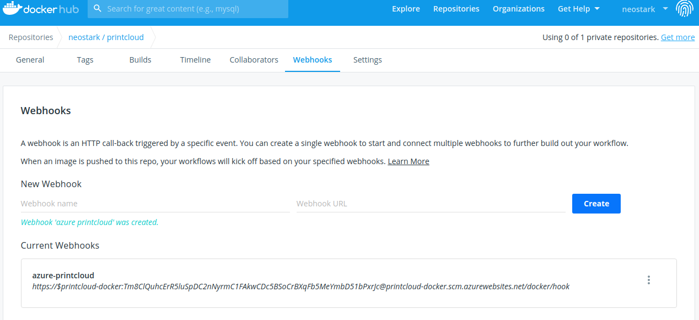

# Despliegue de contenedores en azure

## Despliegue

Para desplegar un contenedor en azure hay que seguir prácticamente los mismos pasos descritos en la sección [Despliegue](despliegue.md) con la única excepción de la última orden, donde en vez de decirle que cree una aplicación web de php, le decimos que vamos a desplegar un contenedor y donde está ese contenedor.

```bash
az webapp create --resource-group IV --plan IV --name printcloud-docker --deployment-container-image-name neostark/printcloud-docker
```
Por otra parte, como tenemos configurada la aplicación para que escuche en el puerto **8080** hay que decirle a azure que escuche en ese puerto también:
```bash
az webapp config appsettings set --resource-group IV --name printcloud-docker --settings WEBSITES_PORT=8080
```

## Implementación Continua

Para configurar la Implementación continua de azure con Docker Hub (el registro donde está alojada la imagen de la aplicación), nos vamos al portal de azure y en el apartado _configuración del contenedor_ de la aplicación realizamos la siguiente configuración:


Una vez activada la implementación continua en azure, solo nos queda copiar el _webhook_ obtenido en el paso anterior e instalarlo en el repositorio de Docker Hub donde tenemos almacenada la imagen de la aplicación para que con cualquier actualización de la imagen Docker Hub avise a azure de que existe una nueva versión disponible.

