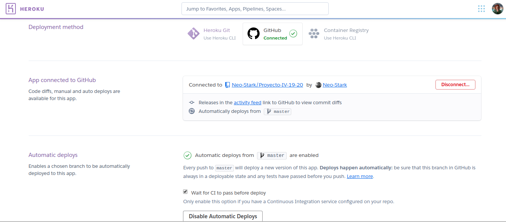

# Despliegue de contenedores en heroku
Desplegar una aplicación web en heroku es realmente sencillo, solamente debemos descargar el CLI de heroku y tener una cuenta en su página web. Una vez registrados, nos logeamos con `heroku login` y ya podremos crear aplicaciones web en heroku.

Para el caso de esta aplicación se va a desplegar un contenedor directamente al PaaS. Para crear la infraestructura base introducimos la siguente orden en la terminal:

```bash
heroku apps:create printcloud-docker --region eu -s container
```

Aquí le estamos diciendo a heroku que cree una nueva aplicación que se llamará _printcloud-docker_, que será desplegada en la región de Europa y que será un contenedor lo que despleguemos posteriormente.

Para implementar la Integración Continua se ha conectado la aplicación con el repositorio en GitHub del proyecto.Así, con cada nuevo push a la rama master del proyecto heroku desplegará de nuevo la aplicación _automáticamente_ con los nuevos cambios si esta pasa todos los tests.



Finalmente, para construir el contenedor cuando los cambios en la aplicación son aceptados, se ha creado el fichero de configuración _heroku.yml_:

```yml
build:
  docker:
    web: Dockerfile
```

Este fichero proporciona muchas opciones para configurar que, como y de que forma construir, añadir y correr el contenedor una vez creado. En nuestro caso solo ha sido necesario indicarle con la sección build el Dockerfile a construir. Por defecto, heroku ejecuta la orden CMD del Dockerfile para correr el contenedor si nosotros no le especificamos ninguna.
