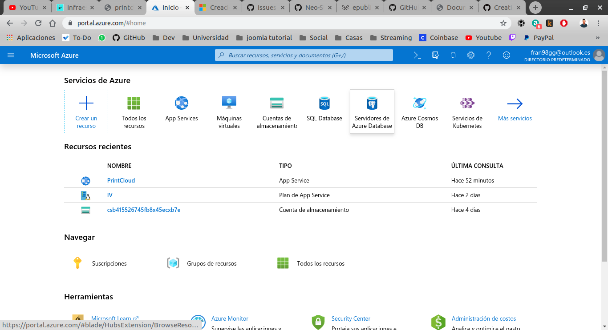
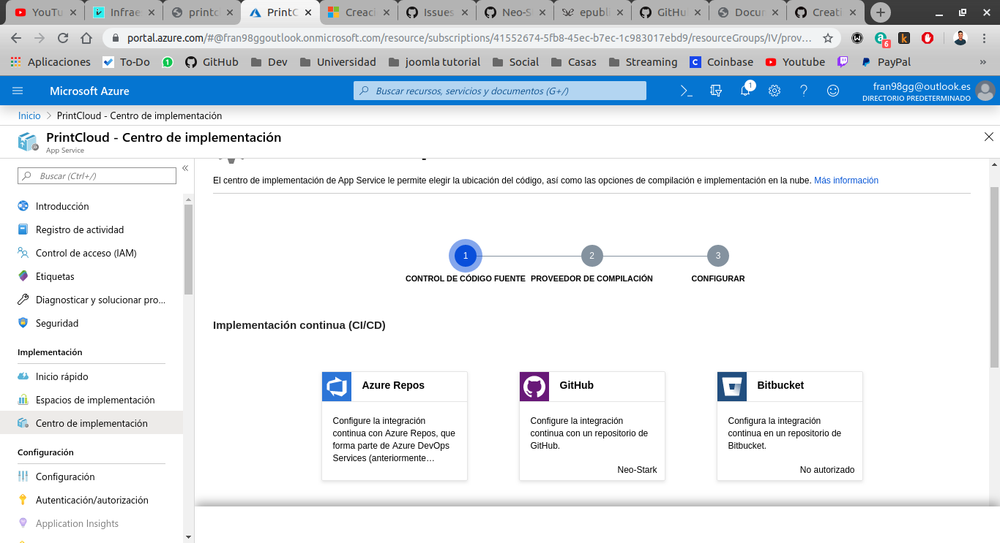
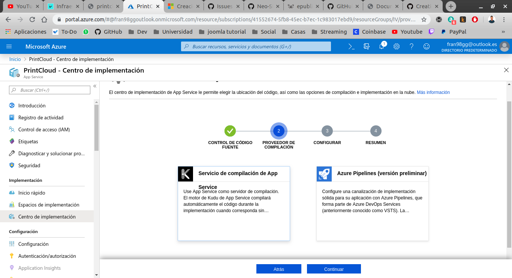
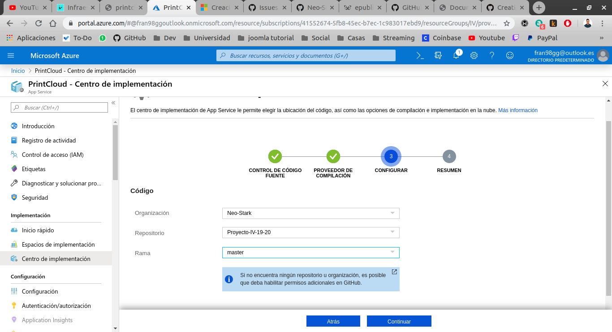
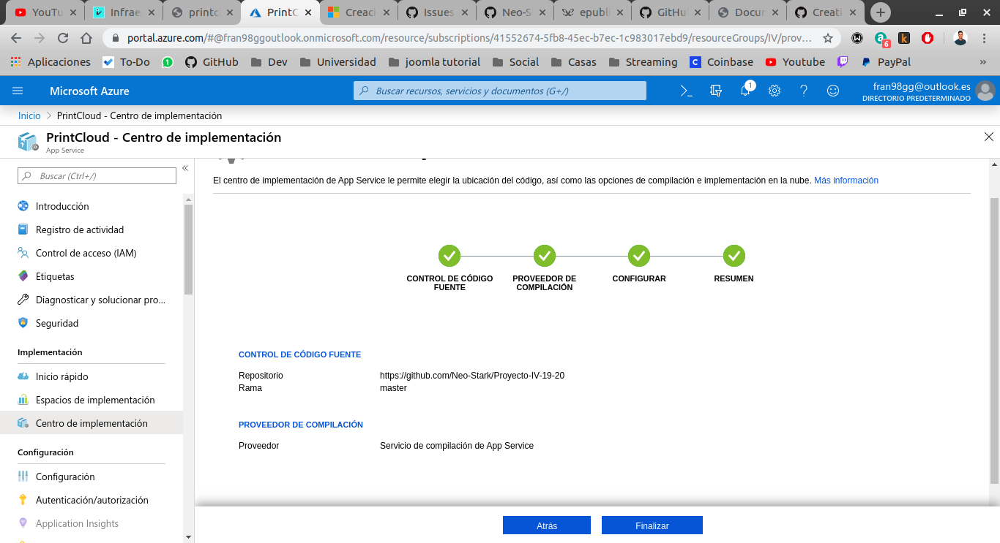

# Despliegue en azure

## Crear un grupo de recursos

Para desplegar una Web App en azure hay que ejecutar una serie de comandos con la cli de azure _az_. A parte de eso no es necesario tener ningún fichero de configuración en nuestro proyecto, ya que, como veremos posteriormente, al indicar el tipo de proyecto que vamos a desplegar azure tiene una configuración por defecto que para nuestro proyecto será suficiente.

En primer lugar, tenemos que crear un 'grupo de recursos' que se trata de un contenedor lógico en el que se implementan y administran recursos de azure. Para crear el grupo de recursos se ejecuta la siguiente orden en la terminal indicando el nombre del grupo y la región donde queremos crearlo (generalmente se crean el grupo de recursos y los recursos en una región cercana).

```bash
az group create --name IV --location "West Europe"
```
## Crear un plan de Azure App Service

Posteriormente hay que crear un plan de Azure App Service. En nuestro caso creamos un plan con el nombre _IV_ que pertenece al grupo _IV_ con un plan de tarifa básico _B1_(el más barato que permite elegir azure) que permite escalar nuestra aplicación si es necesario aunque comparte la máquina donde se ejecuta con otros servicios, pero para nuestro caso será suficiente. Por último, indicamos que nuestro contenedor será linux, ya que por defecto crea máquinas windows de microsoft.

```bash
az appservice plan create --name IV --resource-group IV --sku B1 --is-linux
```

## Creación de una aplicación web

Este es el paso más importante donde creamos efectivamente la aplicación web. Aquí indicamos a que grupo y plan va a pertenecer nuestra aplicación (las que hemos creado anteriormente) y le damos un nombre a la aplicación (debe ser único). Por último, establecemos el tiempo de ejecución en _PHP\|7.2_, esto es muy **importante** ya que gracias a esto le estamos diciendo que nuestra aplicación es PHP y en el momento de subir nuestro código azure desplegará automaticamente los mecanismos que tiene implementado por defecto para la misma. Así que si encuentra un fichero _composer.json_ en la raíz del proyecto ejecutará automaticamente `composer install` para instalar todas las dependencias necesarias de nuestra aplicación.

```bash
az webapp create --resource-group IV --plan IV --name PrintCloud --runtime "PHP|7.2"
```

En este punto, tendremos creada la aplicación web en azure vacia. Ahora nos queda configurar GitHub para que despliegue automáticamente la aplicación cuando hagamos `git push` a nuestro repositorio del proyecto.

# Configuración de GitHub

Para configurar el despligue continuo desde GitHub debemos hacerlo desde la interfaz web de azure.



Una vez dentro, nos vamos a nuestra aplicación web _PrintCloud_ y dentro de configuración nos vamos a _centro de implementación_



Aquí elegimos GitHub en el apartado Implementación Continua. Nos aparecerá una pantalla de login de GitHub donde tendremos que introducir nuestro usuario y contraseña, y darle permisos a azure para acceder a nuestro repositorio.



En este paso debemos elegir el servicio de compilación. Aquí elegimos _Servicio de compilación de App Service_ y le damos a continuar.



Aquí elegimos el repositorio y la rama que queremos desplegar y le damos a continuar.



En este último paso se mostrará la configuración elegida y si todo está correcto le damos a Finalizar y ya tendremos conectado nuestra aplicación web con nuestro repositorio de GitHub. Ahora cuando hagamos un push a la rama master se desplegará automaticamente en azure.

## Particularidad para esta aplicación

Esta aplicación, al utilizar el framework laravel, tiene el punto de entrada en public/index.php, para tener acceso desde la raíz del sitio se ha tenido que crear un fichero .htaccess en la ruta del proyecto para redireccionar a public/index.php cuando entremos al sitio web.
> Nota: el servidor web sobre el que corre la aplicación es Apache

Fichero .htaccess :

```
<IfModule mod_rewrite.c>
    RewriteEngine on

    RewriteRule ^.*$ /public/$1 [NC,L,QSA]
</IfModule>
```