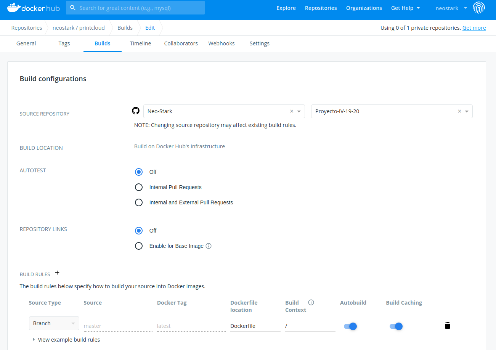

# Integrando Docker Hub con el repositorio de GitHub

Para integrar el registro que hemos creado en Docker Hub para publicar nuestra imagen con el repositorio de GitHub de nuestro proyecto nos vamos al portal de Docker Hub y dentro del repositorio de la aplicación vamos al apartado builds (en nuestro caso neostark/printcloud-docker>builds). Una vez dentro enlazamos con la cuenta de GitHub y hacemos la siguiente configuración:

Aquí lo único que le estamos diciendo es que cada vez que haya un nuevo push a la rama master del proyecto se reconstruya la imagen estableciendo el tag como _latest_.
